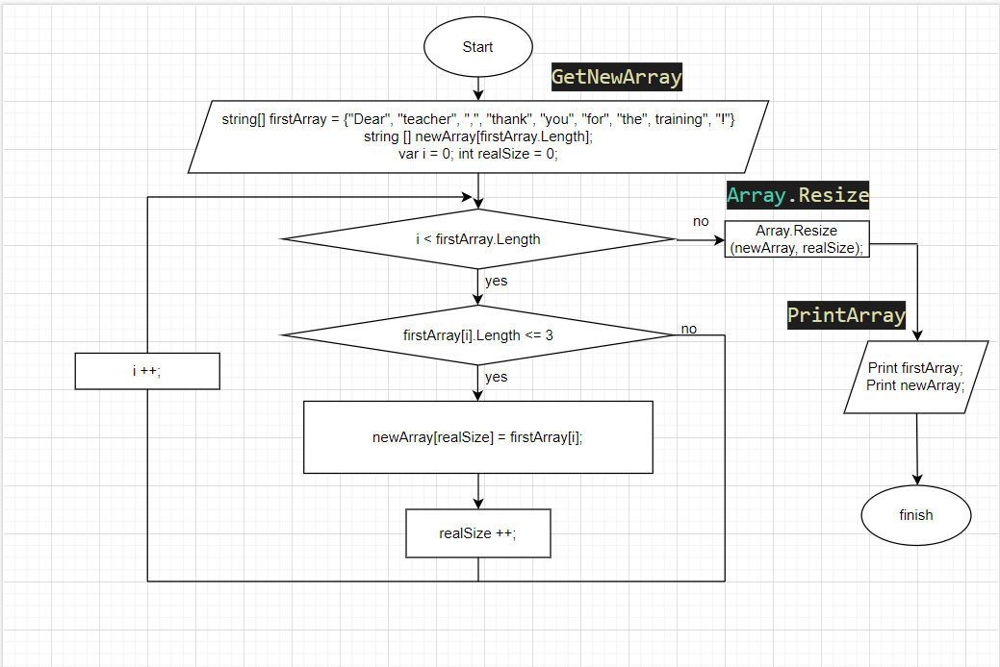

# Задача:
**Написать программу, которая из имеющегося массива строк формирует массив из строк, длинна которых меньше либо равна 3 символа.**
# Решение:
## Задаем массивы и переменные:
1. Массив строк, из которого будем выбирать строки <= 3 (`string[] firstArray = { "Dear", "teacher",  ",", "thank", "you", "for", "the",  "training", "!" }`);
2. Массив, который будет содержать строки <= 3, длинна массива = длинне первого (`string[] newArray [firstArray.Length]`);
3. Переменные: счетчик для цикла `var i = 0`, размер нового массива `int realsize = 0`.

Алгоритм выглядит следующим образом:

## Создаем метод, принимающий заданный массив и выдающий новый массив со строками <= 3 (**GetNewArray**).
Внутри метода: 
1. С помощью цикла *`for`*, перебираем каждую строку массива с условием: если строка меньше или равна 3, то кладем ее в новый массив строк `newArray`;
2. Увеличивая при этом размер переменной `realSize` на 1; 
3. По окончании сортировки массива `firstArray`, изменяем количество элементов в одномерном массиве `newArray` до указанной величины `realSize` с помощью встроенного метода **Array.Resize**;

## Выводим оба массива на экран для сравнения.
Для этого испольщуем метод `void PrintArray`, принимающего массив строк.

Внутри метода, с помощью цикла `foreach`, перебираем каждую строку массива и выводим на экран, в одну строчку.

## Задача решена.